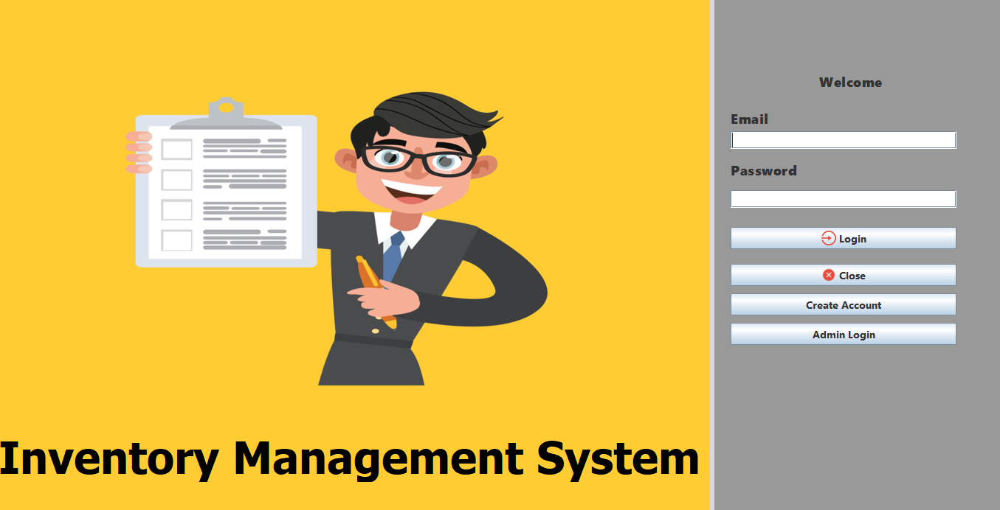
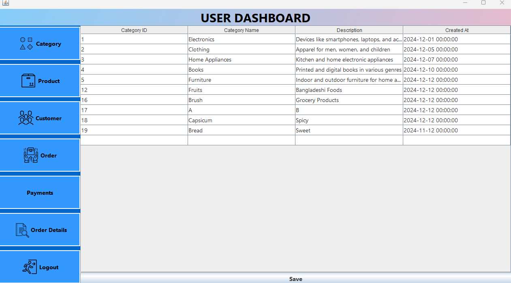
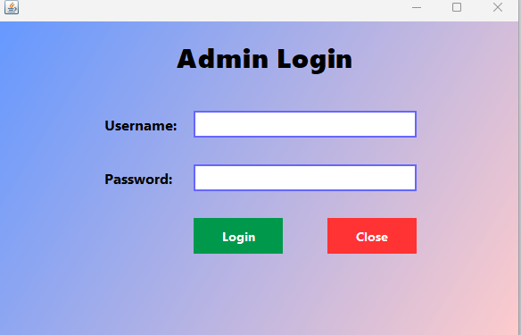

  <h1>📦 Inventory Management System</h1>
  
<em>A Java Swing-based Inventory Management System with Secure Admin Authentication</em>

---

  <h2>📌 Overview</h2>
  

    <strong>InventoryManagementApp</strong> is a desktop application developed using Java Swing that provides a user-friendly interface for managing inventory in small to medium businesses. 
    It features secure admin authentication, user creation, product table viewing, and dashboard functionalities – all built with object-oriented principles and reusable components.
      
    📚 <strong>Educational Purpose:</strong> This project is open-source and intended for learning, academic submissions, and small projects. Everyone is welcome to use, improve, and extend it.
  

---

  <h2>✨ Key Features</h2>
  <ul>
    <li><strong>Admin Login:</strong> Secure login interface for authorized administrators</li>
    <li><strong>User Management:</strong> Admin can create additional users for shared access</li>
    <li><strong>Dashboard:</strong> Central admin panel to manage application activity</li>
    <li><strong>Table View:</strong> Real-time product or inventory display using JTable</li>
    <li><strong>Clean UI:</strong> Built using Java Swing for a desktop-friendly experience</li>
    <li><strong>Modular Design:</strong> Clean code separation across multiple Java classes</li>
  </ul>

---

  <h2>🛠️ Technologies Used</h2>
  <table>
    <thead>
      <tr>
        <th>Technology</th>
        <th>Purpose</th>
      </tr>
    </thead>
    <tbody>
      <tr><td><strong>Java</strong></td><td>Main programming language</td></tr>
      <tr><td><strong>Java Swing</strong></td><td>GUI development for desktop UI</td></tr>
      <tr><td><strong>JTable</strong></td><td>Displaying tabular inventory data</td></tr>
      <tr><td><strong>MySQL</strong></td><td>Database backend for inventory data</td></tr>
      <tr><td><strong>NetBeans</strong></td><td>Recommended IDE for Swing-based development</td></tr>
      <tr><td><strong>XAMPP</strong></td><td>MySQL server for local database setup</td></tr>
    </tbody>
  </table>

---

  <h2>🚀 Getting Started</h2>
  <ol>
    <li>📦 <strong>Clone the repository:</strong>
      <pre><code>git clone https://github.com/MossarrafHossainRobin/InventoryManagementApp.git</code></pre>
    </li>
    <li>🔧 <strong>Open the project in NetBeans IDE.</strong></li>
    <li>💾 <strong>Setup the Database:</strong>
      <ul>
        <li>Install <a href="https://www.apachefriends.org/index.html" target="_blank">XAMPP</a>.</li>
        <li>Start <strong>Apache</strong> and <strong>MySQL</strong> modules from XAMPP Control Panel.</li>
        <li>Go to <a href="http://localhost/phpmyadmin" target="_blank">phpMyAdmin</a>.</li>
        <li>Click on <code>Import</code> tab and choose the file <code>inventorymanagementsystem.sql</code>.</li>
        <li>Click <code>Go</code> to import the database.</li>
      </ul>
    </li>
    <li>🧩 <strong>Configure Database Connection in Code:</strong>
      <ul>
        <li>Check your database config (usually in a DBConnection.java or similar file).</li>
        <li>Ensure the credentials (user, password) and DB name match your XAMPP setup.</li>
      </ul>
    </li>
    <li>▶️ <strong>Build and Run the Project:</strong>
      <ul>
        <li>Right-click on <code>Login.java</code> and select <strong>Run File</strong> in NetBeans.</li>
        <li>Login with default admin credentials (if any provided).</li>
      </ul>
    </li>
  </ol>

---

  <h2>📁 Project Structure</h2>
  <pre style="font-family: monospace;">
InventoryManagementApp/
├── <a href="Orders.png">Orders.png</a>
├── <a href="Orders_background.png">Orders_background.png</a>
├── <a href="Users.png">Users.png</a>
├── <a href="View-orders.png">View-orders.png</a>
├── <a href="category.png">category.png</a>
├── <a href="close.png">close.png</a>
├── <a href="customers.png">customers.png</a>
├── <a href="home_background.png">home_background.png</a>
├── <a href="login-background.PNG">login-background.PNG</a>
├── <a href="login.png">login.png</a>
├── <a href="payments.png">payments.png</a>
├── <a href="product.png">product.png</a>
├── <a href="save.png">save.png</a>
└── <a href="inventorymanagementapp/">inventorymanagementapp/</a>
    ├── <a href="inventorymanagementapp/AdminDashboard.java">AdminDashboard.java</a>
    ├── <a href="inventorymanagementapp/AdminLoginForm.java">AdminLoginForm.java</a>
    ├── <a href="inventorymanagementapp/CreateUserForm.java">CreateUserForm.java</a>
    ├── <a href="inventorymanagementapp/Login.java">Login.java</a>
    └── <a href="inventorymanagementapp/Tables.java">Tables.java</a>
  </pre>

---

  <h2>📸 Screenshots</h2>
  <h4>🔑 Login Screen</h4>
  
  
The initial entry point of the application, where both admins and users can log in based on their credentials.

  <h4>💼 User Dashboard</h4>
  
  
Viewable after successful login. Allows users to browse current stock, request items, or monitor availability based on access level.

  <h4>🔐 Admin Login Interface</h4>
  
  
A secure login screen for administrators, featuring username/password fields and basic validation before granting access.

  <h4>📅 Admin Dashboard</h4>
  
  
The central hub for managing users, products, and viewing inventory analytics. Built with intuitive navigation and real-time feedback.

---

  <h2>❓ Frequently Asked Questions (FAQ)</h2>
  

    
<strong>Can I use this for my university project?</strong>

    
✅ Yes! It’s ideal for academic use and learning purposes.

  

  

    
<strong>Does it support a database?</strong>

    
✅ Yes, this project uses MySQL as the backend database. A ready-to-use SQL file (<code>inventorymanagementsystem.sql</code>) is provided for setup.

  

  

    
<strong>Do I need XAMPP to run this?</strong>

    
🟡 Yes. XAMPP is needed to run the MySQL server locally and manage the inventory database.

  

  

    
<strong>Can I add my own modules?</strong>

    
✅ Absolutely! The code is modular and clean – perfect for customization.

  

---

  <h2>👨‍💻 Authors</h2>
  <table>
    <tr>
      <td align="center" valign="top">
        <strong>Mossarraf Hossain Robin</strong> 
        🎓 CSE Undergraduate Student 
        Green University of Bangladesh  
        
        
        
      </td>
    </tr>
  </table>

---

  <h2>📃 License</h2>
  

    
  

  
This project is licensed under the <strong>MIT License</strong> — you are free to use, modify, and distribute it with attribution.

