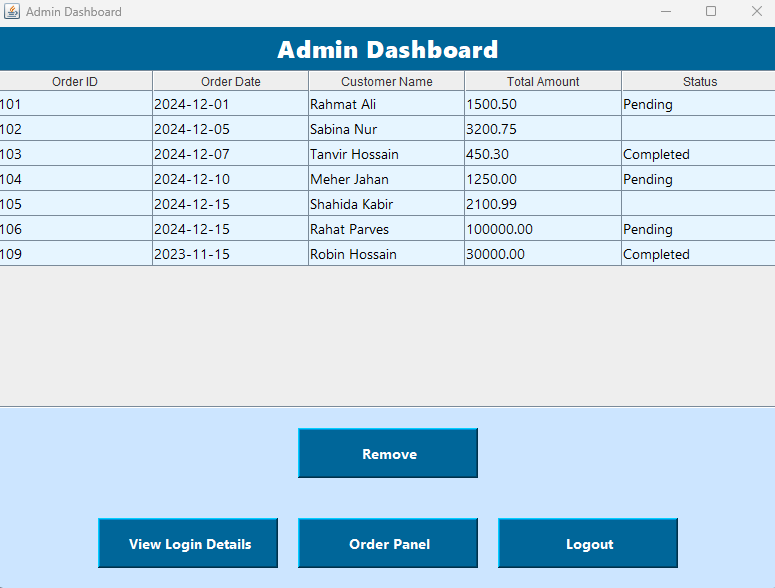

  <h1>📦 Inventory Management System</h1>
  
<em>A Java Swing-based Inventory Management System with Secure Admin Authentication</em>

---

  <h2>📌 Overview</h2>
  

    <strong>InventoryManagementApp</strong> is a desktop application developed using Java Swing that provides a user-friendly interface for managing inventory in small to medium businesses. 
    It features secure admin authentication, user creation, product table viewing, and dashboard functionalities – all built with object-oriented principles and reusable components.
      
    📚 <strong>Educational Purpose:</strong> This project is open-source and intended for learning, academic submissions, and small projects. Everyone is welcome to use, improve, and extend it.
  

---

  <h2>✨ Key Features</h2>
  <ul>
    <li><strong>Admin Login:</strong> Secure login interface for authorized administrators</li>
    <li><strong>User Management:</strong> Admin can create additional users for shared access</li>
    <li><strong>Dashboard:</strong> Central admin panel to manage application activity</li>
    <li><strong>Table View:</strong> Real-time product or inventory display using JTable</li>
    <li><strong>Clean UI:</strong> Built using Java Swing for a desktop-friendly experience</li>
    <li><strong>Modular Design:</strong> Clean code separation across multiple Java classes</li>
  </ul>

---

  <h2>🛠️ Technologies Used</h2>
  <table>
    <thead>
      <tr>
        <th>Technology</th>
        <th>Purpose</th>
      </tr>
    </thead>
    <tbody>
      <tr><td><strong>Java</strong></td><td>Main programming language</td></tr>
      <tr><td><strong>Java Swing</strong></td><td>GUI development for desktop UI</td></tr>
      <tr><td><strong>JTable</strong></td><td>Displaying tabular inventory data</td></tr>
      <tr><td><strong>NetBeans</strong></td><td>Recommended IDE for Swing-based development</td></tr>
      <tr><td><strong>XAMPP (Optional)</strong></td><td>Can be used if you want to integrate a MySQL database</td></tr>
    </tbody>
  </table>

---

  <h2>📦 Installation</h2>
  <ol>
    <li>Install <strong>Java JDK</strong> (version 8 or higher)</li>
    <li>Install <strong>NetBeans IDE</strong> (recommended for Swing development)</li>
    <li>Optional: Install <strong>XAMPP</strong> if you plan to add MySQL or PHPMyAdmin integration</li>
    <li>Clone this repository:
      <pre><code>git clone https://github.com/MossarrafHossainRobin/InventoryManagementApp.git</code></pre>
    </li>
    <li>Open the project in NetBeans:   File → Open Project → Navigate to the downloaded folder</li>
    <li>Build the project to resolve dependencies</li>
    <li>Run <code>Login.java</code> to launch the application</li>
  </ol>

---

  <h2>📁 Project Structure</h2>
  <pre>
InventoryManagementApp/
├── admin-dashboard-inventory.png
├── admin-login-inventory.png
├── user-dashboard-inventory.png
├── login-inventroy.png
├── inventorymanagementapp/
│   ├── AdminDashboard.java
│   ├── AdminLoginForm.java
│   ├── CreateUserForm.java
│   ├── Login.java
│   └── Tables.java
  </pre>

---

  <h2>📸 Screenshots</h2>

  <h4>🔑 Login Screen</h4>
  
  
The initial entry point of the application, where both admins and users can log in based on their credentials.

  <h4>💼 User Dashboard</h4>
  
  
Allows users to browse current stock, request items, or monitor availability based on access level.

  <h4>🔐 Admin Login Interface</h4>
  
  
A secure login screen for administrators, featuring username/password fields and validation.

  <h4>📅 Admin Dashboard</h4>
  
  
Central hub for managing users, products, and viewing inventory analytics with real-time feedback.

---

  <h2>❓ FAQ</h2>

  

    
<strong>Can I use this for my university project?</strong>

    
✅ Yes! It’s ideal for academic use and learning purposes.

  

  

    
<strong>Does it support a database?</strong>

    
✅ Yes, it is fully integrated with a MySQL backend database using XAMPP. All product data, user management, and delete operations are handled via MySQL.

  

  

    
<strong>Do I need XAMPP to run this?</strong>

    
✅ YES. XAMPP is required to run the MySQL server and phpMyAdmin interface used in this project. Ensure it is running before launching the application.

  

  

    
<strong>Can I add my own modules?</strong>

    
✅ Absolutely! The code is modular and clean – perfect for customization.

  

---

  <h2>👨‍💻 Author</h2>
  <table>
    <tr>
      <td align="center" valign="top">
        <strong>Mossarraf Hossain Robin</strong> 
        📠CSE Undergraduate Student 
        Green University of Bangladesh  
        
        
        
      </td>
    </tr>
  </table>

---

  <h2>📃 License</h2>
  

    
  

  
This project is licensed under the <strong>MIT License</strong> — you are free to use, modify, and distribute it with attribution.

---

  
Made with ❤️ for education and practice purposes.

